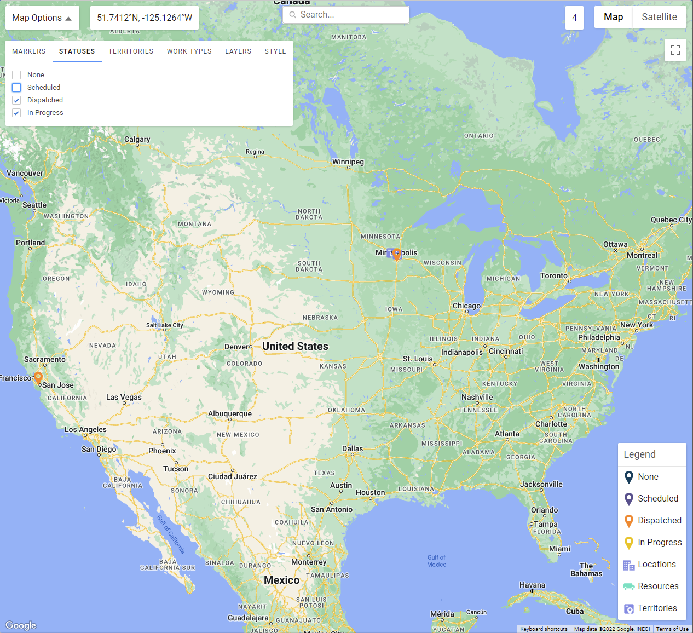

# Field Service Lightning (FSL) Work Map

This map allows you to view [Service Appointments](https://developer.salesforce.com/docs/atlas.en-us.object_reference.meta/object_reference/sforce_api_objects_serviceappointment.htm) or [Work Orders](https://developer.salesforce.com/docs/atlas.en-us.object_reference.meta/object_reference/sforce_api_objects_workorder.htm) with [Locations](https://developer.salesforce.com/docs/atlas.en-us.object_reference.meta/object_reference/sforce_api_objects_location.htm), [Service Resources](https://developer.salesforce.com/docs/atlas.en-us.object_reference.meta/object_reference/sforce_api_objects_serviceresource.htm) and [Service Territories](https://developer.salesforce.com/docs/atlas.en-us.object_reference.meta/object_reference/sforce_api_objects_serviceterritory.htm)!

You can filter by status and also search.

Add layers like drawing, heatmap, polygons and traffic.

Even choose your map style!

You can even use this without the need for a "Dispatcher License".

# Prerequisites

* Enable Field Service in your org
* [Install the FSL managed package](https://fsl.secure.force.com/install)
* Deploy using the button below
* Assign the "Work Map" permission set to anyone who needs access
* Create a new "Work Map" metadata record called "Default" and add your [Google Api Key](https://developers.google.com/maps/documentation/javascript/get-api-key)

# Deploy

# Screenshots

## Filter by Status

## Style the map

# Tests

| Class | Percent | Lines |
| ----- | ------- | ----- |
| WorkMapController | 91% | 119/130 |